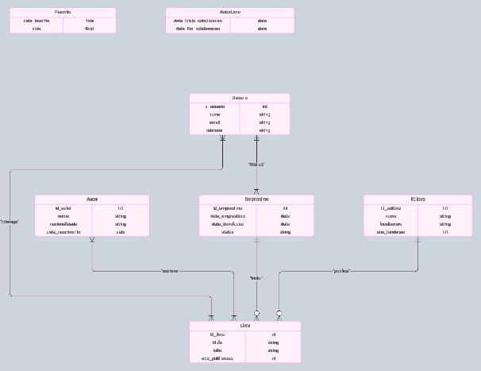

# Projeto2
 
### Estrutura do Sistema de Biblioteca Digital

#### Entidades e Atributos:
1. **Livro** (`id_livro`, `titulo`, `isbn`, `ano_publicacao`)
2. **Autor** (`id_autor`, `nome`, `nacionalidade`, `data_nascimento`)
3. **Editora** (`id_editora`, `nome`, `localizacao`, `ano_fundacao`)
4. **Usuário** (`id_usuario`, `nome`, `email`, `telefone`)
5. **Empréstimo** (`id_emprestimo`, `data_emprestimo`, `data_devolucao`, `status`)

#### Relacionamentos:
1. **Autor - Livro (n:m)**: Cada autor pode escrever vários livros, e cada livro pode ter múltiplos autores.
   - **Atributos do relacionamento**: `data_inicio_colaboracao`, `data_fim_colaboracao`

2. **Usuário - Empréstimo (1:n)**: Cada usuário pode realizar vários empréstimos, e cada empréstimo só pode ter um usuário.

3. **Empréstimo - Livro (1:n)**: Cada empréstimo pode incluir vários livros, e cada livro só pode estar em um empréstimo de cada vez.
   - **Atributos do relacionamento**: `data_emprestimo`, `data_devolucao`
   
4. **Editora - Livro (1:n)**: Cada livro é publicado por uma editora, e uma editora pode publicar vários livros.

5. **Usuário - Livro (n:m)**: Cada usuário pode favoritar ou avaliar vários livros, e cada livro pode ser favorito ou avaliado por vários usuários.
   - **Atributos do relacionamento**: `data_favorito`, `nota` (representa a data em que o livro foi favoritado e a nota dada pelo usuário)

---
### Modelo Entidade Relacionamento



### Modelo Relacional e Normalização (3FN)

Para a normalização, cada entidade e relacionamento será convertido em tabelas separadas, garantindo que não haja redundâncias desnecessárias e que todas as dependências sejam totalmente funcionais.

### Exemplo de Queries SQL

Com essa estrutura, aqui estão algumas queries úteis que atendem aos objetivos do projeto:
1. **Listar todos os livros e seus autores**:
   ```sql
   SELECT L.titulo, A.nome AS autor
   FROM Livro L
   JOIN Autor_Livro AL ON L.id_livro = AL.id_livro
   JOIN Autor A ON AL.id_autor = A.id_autor;
   ```

2. **Consultar os livros mais populares (mais emprestados)**:
   ```sql
   SELECT L.titulo, COUNT(EL.id_emprestimo) AS total_emprestimos
   FROM Livro L
   JOIN Emprestimo_Livro EL ON L.id_livro = EL.id_livro
   GROUP BY L.id_livro
   ORDER BY total_emprestimos DESC
   LIMIT 10;
   ```

3. **Listar todos os empréstimos ativos, com o nome do usuário e as datas de devolução**:
   ```sql
   SELECT U.nome AS usuario, E.data_emprestimo, E.data_devolucao
   FROM Emprestimo E
   JOIN Usuario U ON E.id_usuario = U.id_usuario
   WHERE E.status = 'ativo';
   ```

4. **Encontrar autores que publicaram mais de `x` livros**:
   ```sql
   SELECT A.nome, COUNT(AL.id_livro) AS total_livros
   FROM Autor A
   JOIN Autor_Livro AL ON A.id_autor = AL.id_autor
   GROUP BY A.id_autor
   HAVING total_livros > x;
   ```

5. **Exibir todos os livros publicados por uma determinada editora**:
   ```sql
   SELECT L.titulo
   FROM Livro L
   JOIN Editora E ON L.id_editora = E.id_editora
   WHERE E.nome = 'Nome da Editora';
   ```

6. **Buscar usuários com mais empréstimos**:
   ```sql
   SELECT U.nome, COUNT(E.id_emprestimo) AS total_emprestimos
   FROM Usuario U
   JOIN Emprestimo E ON U.id_usuario = E.id_usuario
   GROUP BY U.id_usuario
   ORDER BY total_emprestimos DESC
   LIMIT 10;
   ```