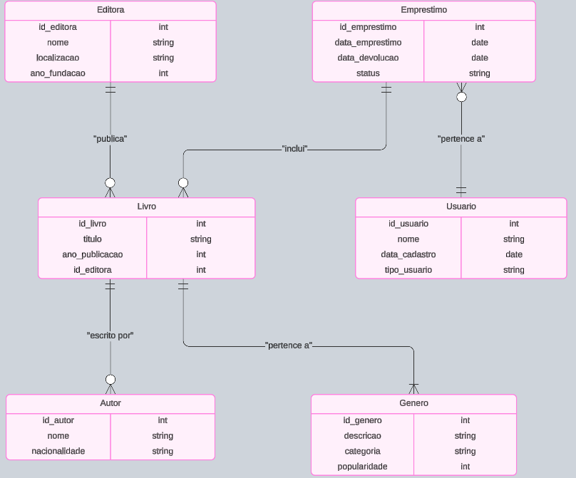

# Projeto 2

### Tema do Projeto: Sistema de Gerenciamento de Biblioteca

#### 1. Modelo Entidade-Relacionamento (MER)

**Entidades:**
1. **Livro** - Atributos: `id_livro`, `titulo`, `ano_publicacao`, `id_editora`.
2. **Autor** - Atributos: `id_autor`, `nome`, `nacionalidade`.
3. **Gênero** - Atributos: `id_genero`, `descricao`, `categoria`, `popularidade`.
4. **Usuário** - Atributos: `id_usuario`, `nome`, `data_cadastro`, `tipo_usuario` (ex: estudante, professor).
5. **Empréstimo** - Atributos: `id_emprestimo`, `data_emprestimo`, `data_devolucao`, `status`.
6. **Editora** - Atributos: `id_editora`, `nome`, `localizacao`, `ano_fundacao`.

**Relacionamentos:**
1. **Livro - Autor (N:M)**: Um livro pode ter vários autores e um autor pode ter escrito vários livros.
2. **Livro - Gênero (N:M)**: Um livro pode pertencer a vários gêneros e um gênero pode incluir vários livros.
3. **Empréstimo - Usuário (N:1)**: Um empréstimo pertence a um único usuário, mas um usuário pode fazer vários empréstimos.
4. **Empréstimo - Livro (1:N)**: Um empréstimo pode incluir vários livros, e cada livro só pode estar em um empréstimo de cada vez.
5. **Editora - Livro (1:N)**: Cada livro é publicado por uma editora, e uma editora pode publicar vários livros.


#### . Modelo Entidade Relacionamento



#### 3. Modelo Relacional na 3FN (Normalização)

| Tabela         | Atributos                                                                                   |
|----------------|---------------------------------------------------------------------------------------------|
| Livro          | `id_livro` (PK), `titulo`, `ano_publicacao`, `id_editora` (FK)                                    |
| Autor          | `id_autor` (PK), `nome`, `nacionalidade`                                                          |
| Gênero         | `id_genero` (PK), `descricao`, `categoria`, `popularidade`                                         |
| Usuário        | `id_usuario` (PK), `nome`, `data_cadastro`, `tipo_usuario`                                          |
| Empréstimo     | `id_emprestimo` (PK), `data_emprestimo`, `data_devolucao`, `status`, `id_usuario` (FK)                 |
| Editora        | `id_editora` (PK), `nome`, `localizacao`, `ano_fundacao`                                    |
| Livro_Autor    | `id_livro` (PK, FK), `id_autor` (PK, FK)                                                    |
| Livro_Gênero   | `id_livro` (PK, FK), `id_genero` (PK, FK)                                                   |
| Emprestimo_Livro | `id_emprestimo` (PK, FK), `id_livro` (FK)                                                |

#### 4. Queries para Criação das Tabelas

```sql
CREATE TABLE Editora (
    id_editora INT PRIMARY KEY,
    nome VARCHAR(100),
    localizacao VARCHAR(100),
    ano_fundacao INT
);

CREATE TABLE Livro (
    id_livro INT PRIMARY KEY,
    titulo VARCHAR(255),
    ano_publicacao INT,
    id_editora INT,
    FOREIGN KEY (id_editora) REFERENCES Editora(id_editora)
);

CREATE TABLE Autor (
    id_autor INT PRIMARY KEY,
    nome VARCHAR(255),
    nacionalidade VARCHAR(50)
);

CREATE TABLE Gênero (
    id_genero INT PRIMARY KEY,
    descricao VARCHAR(100),
    categoria VARCHAR(50),
    popularidade INT
);

CREATE TABLE Usuário (
    id_usuario INT PRIMARY KEY,
    nome VARCHAR(255),
    data_cadastro DATE,
    tipo_usuario VARCHAR(50)
);

CREATE TABLE Empréstimo (
    id_emprestimo INT PRIMARY KEY,
    data_emprestimo DATE,
    data_devolucao DATE,
    status VARCHAR(50),
    id_usuario INT,
    FOREIGN KEY (id_usuario) REFERENCES Usuário(ID)
);

CREATE TABLE Livro_Autor (
    id_livro INT,
    id_autor INT,
    PRIMARY KEY (id_livro, id_autor),
    FOREIGN KEY (id_livro) REFERENCES Livro(id_livro),
    FOREIGN KEY (id_autor) REFERENCES Autor(id_autor)
);

CREATE TABLE Livro_Gênero (
    id_livro INT,
    id_genero INT,
    PRIMARY KEY (id_livro, id_genero),
    FOREIGN KEY (id_livro) REFERENCES Livro(id_livro),
    FOREIGN KEY (id_genero) REFERENCES Gênero(id_genero)
);

CREATE TABLE Emprestimo_Livro (
    id_emprestimo INT,
    id_livro INT,
    PRIMARY KEY (id_emprestimo, id_livro),
    FOREIGN KEY (id_emprestimo) REFERENCES Empréstimo(id_emprestimo),
    FOREIGN KEY (id_livro) REFERENCES Livro(id_livro)
);
```

#### 5. Código para Inserção de Dados Aleatórios

```sql
-- Inserindo dados na tabela Editora
INSERT INTO Editora (id_editora, nome, localizacao, ano_fundacao) VALUES
(1, 'Editora A', 'São Paulo', 1950),
(2, 'Editora B', 'Rio de Janeiro', 1985);

-- Inserindo dados na tabela Livro
INSERT INTO Livro (id_livro, titulo, ano_publicacao, id_editora) VALUES
(1, 'Dom Casmurro', 1899, 1),
(2, 'O Cortiço', 1890, 2);

-- Inserindo dados na tabela Autor
INSERT INTO Autor (id_autor, nome, nacionalidade) VALUES
(1, 'Machado de Assis', 'Brasileiro'),
(2, 'Aluísio Azevedo', 'Brasileiro');

-- Inserindo dados na tabela Gênero
INSERT INTO Gênero (id_genero, descricao, categoria, popularidade) VALUES
(1, 'Romance', 'Ficção', 85),
(2, 'Realismo', 'Ficção', 90);

-- Inserindo dados na tabela Usuário
INSERT INTO Usuário (id_usuario, nome, data_cadastro, tipo_usuario) VALUES
(1, 'Carlos Silva', '2024-01-15', 'Estudante'),
(2, 'Ana Souza', '2024-02-20', 'Professor');

-- Inserindo dados na tabela Empréstimo
INSERT INTO Empréstimo (id_emprestimo, data_emprestimo, data_devolucao, status, id_usuario) VALUES
(1, '2024-10-01', '2024-10-15', 'Devolvido', 1),
(2, '2024-11-05', NULL, 'Pendente', 2);

-- Inserindo dados na tabela Livro_Autor
INSERT INTO Livro_Autor (id_livro, id_autor) VALUES
(1, 1),
(2, 2);

-- Inserindo dados na tabela Livro_Gênero
INSERT INTO Livro_Gênero (id_livro, id_genero) VALUES
(1, 1),
(2, 2);

-- Inserindo dados na tabela Emprestimo_Livro
INSERT INTO Emprestimo_Livro (id_emprestimo, id_livro) VALUES
(1, 1),
(2, 2);
```

#### 5. Consultas SQL Interessantes

1. **Listar todos os livros com seus autores e editoras**
   ```sql
   SELECT Livro.titulo, Autor.nome AS autor, Editora.nome AS editora
   FROM Livro
   JOIN Livro_Autor ON Livro.id_livro = Livro_Autor.id_livro
   JOIN Autor ON Livro_Autor.id_autor = Autor.id_autor
   JOIN Editora ON Livro.id_editora = Editora.id_editora;
   ```

2. **Listar todos os empréstimos com o status 'Pendente' e os detalhes do usuário**
   ```sql
   SELECT Empréstimo.id_emprestimo, Usuário.nome AS usuario, Empréstimo.data_emprestimo
   FROM Empréstimo
   JOIN Usuário ON Empréstimo.id_usuario = Usuário.id_usuario
   WHERE Empréstimo.status = 'Pendente';
   ```

3. **Contar quantos livros cada usuário já emprestou**
   ```sql
   SELECT Usuário.nome, COUNT(Emprestimo_Livro.id_livro) AS total_livros
   FROM Usuário
   JOIN Empréstimo ON Usuário.id_usuario = Empréstimo.id_usuario
   JOIN Emprestimo_Livro ON Empréstimo.id_emprestimo = Emprestimo_Livro.id_emprestimo
   GROUP BY Usuário.nome;
   ```

4. **Listar os livros por gênero e categoria**
   ```sql
   SELECT Gênero.descricao, Gênero.categoria, Livro.titulo
   FROM Gênero
   JOIN Livro_Gênero ON Gênero.id_genero = Livro_Gênero.id_genero
   JOIN Livro ON Livro_Gênero.id_livro = Livro.id_livro;
   ```

5. **Encontrar o usuário com mais empréstimos realizados**
   ```sql
   SELECT Usuário.nome, COUNT(Empréstimo.id_emprestimo) AS total_emprestimos
   FROM Usuário
   JOIN Empréstimo ON Usuário.id_usuario = Empréstimo.id_usuario
   GROUP BY Usuário.nome
   ORDER BY total_emprestimos DESC
   LIMIT 1;
   ```

6. **Obter o número total de livros por editora**
   ```sql
   SELECT Editora.nome, COUNT(Livro.id_livro) AS total_livros
   FROM Editora
   JOIN Livro ON Editora.id_editora = Livro.id_editora
   GROUP BY Editora.nome;
   ```

7. **Listar autores que já escreveram mais de um livro**
   ```sql
   SELECT Autor.nome, COUNT(Livro_Autor.id_livro) AS total_livros
   FROM Autor
   JOIN Livro_Autor ON Autor.id_autor = Livro_Autor.id_autor
   GROUP BY Autor.nome
   HAVING total_livros > 1;
   ```

8. **Listar todos os livros que nunca foram emprestados**
   ```sql
   SELECT Livro.titulo
   FROM Livro
   LEFT JOIN Emprestimo_Livro ON Livro.id_livro = Emprestimo_Livro.id_livro
   WHERE Emprestimo_Livro.id_emprestimo IS NULL;
   ```

9. **Obter a popularidade média dos gêneros e organizá-los em ordem decrescente**
   ```sql
   SELECT descricao, categoria, AVG(popularidade) AS popularidade_media
   FROM Gênero
   GROUP BY descricao, categoria
   ORDER BY popularidade_media DESC;
   ```

10. **Listar os usuários que pegaram livros emprestados mais recentemente**
    ```sql
    SELECT Usuário.nome, Empréstimo.data_emprestimo
    FROM Empréstimo
    JOIN Usuário ON Empréstimo.id_usuario = Usuário.id_usuario
    ORDER BY Empréstimo.data_emprestimo DESC
    LIMIT 5;
    ```
